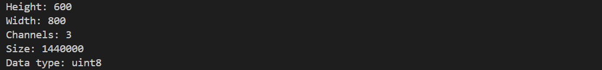

# Assignment 1 

## Print image information of the picture "iris-1.jpg" into console using the openCV library

In this assignment the task was to print out the Witdh, Hight, Channel, Size and Data type of this image: 

Output of the code is: 

## Web camera information saved into a txt file

to save information about web camera into a text file the documentation form geeks for geeks:[Python OpenCV: Capture Video from Camera ](https://www.geeksforgeeks.org/python/python-opencv-capture-video-from-camera/) was used as well as W3school [Python File Write](https://www.w3schools.com/python/python_file_write.asp) documentation. 

The output from the code is in camera_outputs.txt
